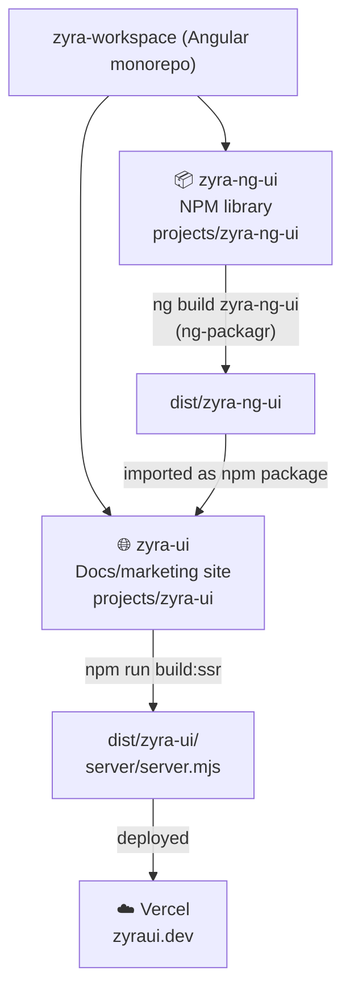
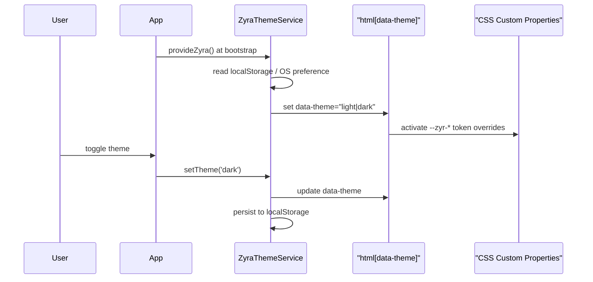
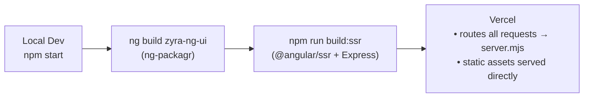

# Zyra UI — Architecture

> **Tip:** Install the [Markdown Preview Mermaid Support](https://marketplace.visualstudio.com/items?itemName=bierner.markdown-mermaid) VS Code extension to render these diagrams inline.

---

## 1. Monorepo Overview



---

## 2. Library — `zyra-ng-ui`

```mermaid
graph TD
    LIB["zyra-ng-ui"]

    LIB --> THEME["🎨 Theme System"]
    THEME --> TS["ZyraThemeService\ntheme-service.ts"]
    THEME --> TT["ZyraTheme type\ntheme-type.ts"]
    THEME --> PZ["provideZyra()\nprovide-zyra.ts"]

    LIB --> SCSS["🖌️ SCSS Tokens\n(--zyr-* CSS custom properties)"]
    SCSS --> SH["_shared-theme.scss\n(palette, radius, spacing, motion)"]
    SCSS --> LT["_light-theme.scss"]
    SCSS --> DT["_dark-theme.scss"]
    SCSS --> AN["_animations.scss"]
    SCSS --> MX["_mixins.scss"]
    SCSS --> B["_base.scss"]

    LIB --> COMP["🧩 Components (22)"]

    COMP --> FORM["Form Controls"]
    FORM --> c1["ZyraInput"]
    FORM --> c2["ZyraFormField\n+ ZyrPrefix / ZyrSuffix"]
    FORM --> c3["ZyraSelect + ZyraOption"]
    FORM --> c4["ZyraTextarea"]
    FORM --> c5["ZyraCheckbox"]
    FORM --> c6["ZyraRadio + ZyraRadioGroup"]
    FORM --> c7["ZyraToggle"]

    COMP --> DISPLAY["Display / Layout"]
    DISPLAY --> d1["ZyraCard"]
    DISPLAY --> d2["ZyraAvatar"]
    DISPLAY --> d3["ZyraBadge"]
    DISPLAY --> d4["ZyraChip"]
    DISPLAY --> d5["ZyraDivider"]
    DISPLAY --> d6["ZyraSkeleton"]
    DISPLAY --> d7["ZyraProgress"]

    COMP --> OVERLAY["Overlay / Feedback"]
    OVERLAY --> o1["ZyraModal"]
    OVERLAY --> o2["ZyraToast\n+ ZyraToastContainer\n+ ZyraToastService"]
    OVERLAY --> o3["ZyraTooltip"]
    OVERLAY --> o4["ZyraAlert"]
    OVERLAY --> o5["ZyraSpinner"]

    COMP --> NAV["Navigation"]
    NAV --> n1["ZyraTabs + ZyraTab"]
    NAV --> n2["ZyraAccordion\n+ ZyraAccordionItem"]
    NAV --> n3["ZyraButton"]
```



---

## 3. App — `zyra-ui`

```mermaid
graph TD
    APP["zyra-ui (Angular 21 SSR)"]

    APP --> CONFIG["app.config.ts\n• provideZyra()\n• provideRouter()\n• provideClientHydration()\n• provideHttpClient()"]

    APP --> LAYOUT["Layout (always rendered)"]
    LAYOUT --> H["Header\n• Theme toggle\n• Nav links\n• Sidebar toggle"]
    LAYOUT --> S["Sidebar\n• 260px / 84px (signal-based)\n• Component nav links"]
    LAYOUT --> F["Footer"]

    APP --> ROUTES["Lazy-loaded Routes"]
    ROUTES --> R1["/ → Home\n(hero, features, install guide)"]
    ROUTES --> R2["/components → UiComponents\n(component gallery)"]
    ROUTES --> R3["/components/:component → UiComponentDetail\n(playground per component)"]
    ROUTES --> R4["/blog → BlogList"]
    ROUTES --> R5["/blog/:slug → BlogDetails\n(markdown rendered)"]
    ROUTES --> R6["/docs → Docs"]
    ROUTES --> R7["/about → About"]
    ROUTES --> R8["/contact → Contact"]
    ROUTES --> R9["/privacy → PrivacyPolicy"]
    ROUTES --> R10["/terms → TermsOfServices"]

    APP --> SVC["Services"]
    SVC --> BS["BlogService\n• fetches /content/index.json\n• fetches /content/{slug}.md"]
    SVC --> SEO["SeoService\n• title, meta, OG tags\n• canonical URL"]
    SVC --> GH["GithubService"]
```



---

## 4. Component Playground Structure

Each component under `/components/:component` has its own playground page:

```mermaid
graph LR
    DETAIL["UiComponentDetail\n(router outlet)"]
    DETAIL --> PG["comp/\n(playground pages)"]
    PG --> accordion & alert & avatar & badge & button
    PG --> card & checkbox & chip & divider & "form-field"
    PG --> input & modal & progress & radio & select
    PG --> skeleton & spinner & tabs & textarea & toast
    PG --> toggle & tooltip
```

---

## 5. Theme Flow



---

## 6. Build & Deploy Pipeline



---

## 7. Key Technology Decisions

| Concern           | Choice                           | Why                                    |
| ----------------- | -------------------------------- | -------------------------------------- |
| Framework         | Angular 21                       | Signals-first, zoneless, SSR-native    |
| Change detection  | OnPush + signals                 | No zone.js, explicit reactivity        |
| Styling           | SCSS + CSS custom properties     | Runtime theme switching without JS     |
| SSR               | `@angular/ssr` + Express         | SEO, fast initial paint                |
| Deployment        | Vercel                           | Zero-config SSR, edge CDN              |
| Library packaging | `ng-packagr`                     | Produces proper Angular Package Format |
| Blog              | Markdown + `ngx-markdown`        | Content editable without rebuilds      |
| Fonts             | Outfit / IBM Plex Sans / JetBrains Mono | Display / body / mono roles         |
