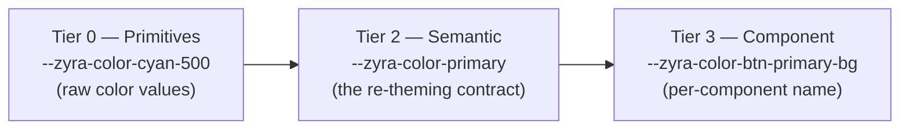

# Angular Design Tokens: Theming Without Breaking on Override

> **TL;DR:** A themeable component library needs three token tiers, not one: raw primitives (Tier 0), semantic tokens like `--color-primary` (Tier 2), and per-component tokens like `--button-primary-bg` (Tier 3). Components must only ever read Tier 2 or Tier 3. The moment a component reads a Tier 0 primitive directly, a consumer's theme override silently stops working for that component — and nobody gets an error telling them why.

You override one CSS custom property, expecting your whole app to re-theme, and half of it doesn't move. No console error, no warning — some components just quietly keep their old color. This is one of the most common ways component libraries fail at theming, and it almost always comes down to the same root cause: a component reached past the token layer meant for consumers and grabbed a raw, internal value instead.

This post walks through the token architecture that avoids that failure mode entirely — a pattern used across Zyra UI's Angular component library to support five shipped themes (dark, light, ocean, amber, rose) from a single override surface.

## The failure mode: why overrides silently do nothing

Say a library defines a raw theme value like this:

```scss
// _dark-theme.scss
:root[data-theme='dark'] {
    --zyra-color-accent: #18d5ea;
}
```

And a button component reads it directly:

```scss
// zyra-button.scss — the wrong way
.zyra-button--primary {
    background: var(--zyra-color-accent);
}
```

Now a consumer of your library wants their brand color everywhere, so they override the property they can see in DevTools:

```css
:root {
    --zyra-color-primary: #ff6600;
}
```

Nothing happens to the button. It's still cyan. The consumer assumes they made a typo, checks spelling, checks specificity, eventually gives up and starts writing `!important` overrides against your internal class names — which breaks the next time you ship a minor version.

The bug isn't in their override. It's that the button never had a relationship with `--zyra-color-primary` in the first place. It was reading `--zyra-color-accent`, a completely different variable that happens to produce a similar-looking cyan in the dark theme.

## The fix: three tiers, one direction of reference

The fix is architectural, not a naming convention. Split tokens into three tiers, and enforce that components can only read from the top two.



**Tier 0 — Primitives.** Raw values with no meaning attached: a specific hex code, a specific pixel size. Primitives are theme-specific and never appear in component SCSS.

```scss
// _dark-theme.scss   (Tier 0, scoped per theme)
:root[data-theme='dark'] {
    --zyra-color-accent: #18d5ea;
}

// _light-theme.scss
:root[data-theme='light'] {
    --zyra-color-accent: #007a8a;
}

// _ocean-theme.scss
:root[data-theme='ocean'] {
    --zyra-color-accent: #1a6ec8;
}
```

Notice each theme defines its own `--zyra-color-accent`. That's expected — it's the raw per-theme value, and it's allowed to differ wildly between themes. What's not allowed is a component reading it directly, because then the component is coupled to "whatever accent this particular theme happens to use" instead of to a stable, overridable concept.

**Tier 2 — Semantic.** This is the actual contract you expose to consumers. It names *intent*, not color:

```scss
// _tokens-semantic.scss
:root {
    --zyra-color-primary: var(--zyra-color-accent);
    --zyra-color-foreground: var(--zyra-color-text);
    --zyra-color-surface: var(--zyra-color-card-bg);
    --zyra-color-border-color: var(--zyra-color-border);
}
```

A consumer overriding `--zyra-color-primary` is now overriding something with a single, well-defined meaning: "the brand color." Every component that wants the brand color reads this token — never the primitive underneath it.

**Tier 3 — Component.** Individual components get their own namespaced token that points at a semantic token, not a primitive:

```scss
// _tokens-components.scss
:root {
    --zyra-color-btn-primary-bg: var(--zyra-color-primary);
}

// zyra-button.scss — the correct way
.zyra-button--primary {
    background: var(--zyra-color-btn-primary-bg);
}
```

Now trace what happens when a consumer overrides `--zyra-color-primary: #ff6600`:

`--zyra-color-primary` changes → `--zyra-color-btn-primary-bg` changes (it references Tier 2) → the button's `background` changes (it references Tier 3). One override, and everything downstream follows, because the reference chain only ever points one direction: component tokens point at semantic tokens, semantic tokens point at primitives, and nothing points backwards.

## Why not just use the semantic token directly everywhere?

It's tempting to skip Tier 3 and have every component read `--zyra-color-primary` straight from Tier 2. This works until two components need the *same* semantic concept to render *differently*.

A table's hover row and a sidebar's active item are both "a subtle highlight over the primary color," but they're not identical shades — the table wants something closer to the surface color, the sidebar wants full-strength primary. If both hardcode `--zyra-color-primary` directly, you can't tune one without the other. The Tier 3 token gives each component a seam to adjust its own value without ever touching the semantic contract:

```scss
:root {
    --zyra-color-table-row-hover-bg: var(--zyra-color-surface);
    --zyra-color-sidebar-active-bg: var(--zyra-color-primary);
}
```

Both still trace back to Tier 2 tokens — so a full re-theme via `--zyra-color-primary` or `--zyra-color-surface` still cascades — but each component keeps its own tuning knob.

## Enforcing the rule so it doesn't rot

Architecture only holds if something checks it. The cheapest check is a grep run before every commit that touches component styles, matching for known Tier 0 / internal token names inside a component's `.scss` file:

```bash
grep -nE "var\(--zyra-color-(accent|text|border|bg-app|bg-surface|card-bg)\)" \
  path/to/your-component.scss
```

Any match is a violation — the component reached past the semantic layer. This is worth wiring into a pre-commit hook or CI step once your token set stabilizes, because the failure mode is silent by nature: nothing throws, nothing warns, a theme override just quietly stops applying to one component, and it's easy to not notice until a user reports it.

## Building a component with this pattern from scratch

Say you're adding a new `zyra-badge` component with a colored background. The order matters:

1. **Check if a semantic token already covers your need.** For a status badge, `--zyra-color-success`, `--zyra-color-warning`, `--zyra-color-danger`, and `--zyra-color-info` likely already exist.
2. **Add the Tier 3 stub first**, before writing any component SCSS:

```scss
// _tokens-components.scss
:root {
    --zyra-color-badge-success-bg: var(--zyra-color-success-subtle);
    --zyra-color-badge-success-text: var(--zyra-color-on-success);
}
```

3. **Reference only the Tier 3 token in the component:**

```scss
// zyra-badge.scss
.zyra-badge--success {
    background: var(--zyra-color-badge-success-bg);
    color: var(--zyra-color-badge-success-text);
}
```

4. **Verify across every shipped theme**, not just the one you're developing in. A background that reads fine in a dark theme can fail contrast entirely in a light or amber theme — this is exactly the class of bug the token system exists to catch early, since a broken reference chain (not a broken color choice) is usually the actual cause.

## Handling text-on-fill contrast with `on-*` tokens

A background token alone doesn't guarantee readable text. Filled backgrounds need a matching `on-*` token so text color is chosen deliberately, not assumed:

```scss
.zyra-alert--warning {
    background: var(--zyra-color-warning);
    color: var(--zyra-color-on-warning); // not #fff — warning amber fails contrast with white text
}
```

`--zyra-color-on-warning` typically resolves to a dark, near-black brown rather than white, because bright warning ambers frequently fail WCAG AA contrast against white text but pass comfortably against a dark one. Pairing every filled semantic background with its `on-*` counterpart avoids re-deriving this contrast decision per component — and per theme.

## Quick reference

| Tier | Purpose | Example | Who reads it |
|---|---|---|---|
| 0 — Primitive | Raw theme-specific value | `--zyra-color-accent: #18d5ea` | Only Tier 2 tokens |
| 2 — Semantic | Named intent, the re-theming contract | `--zyra-color-primary` | Only Tier 3 tokens (and docs) |
| 3 — Component | Per-component, per-state knob | `--zyra-color-btn-primary-bg` | Component SCSS |

The rule that keeps the whole system honest: **references only ever point downward** — Tier 3 to Tier 2, Tier 2 to Tier 0 — and component SCSS files only ever read Tier 2 or Tier 3. The moment that direction breaks, in either place, theming silently stops working for whatever reached across it.

## Frequently asked questions

### Why does overriding a CSS custom property not change my Angular component's color?

The component is very likely reading a raw, internal token instead of the semantic token you overrode. Check the component's compiled CSS for a `var(--your-property)` reference — if the property name in the component doesn't match the one you overrode, and there's no token in between connecting them, the override has no path to reach the component. Add or fix the semantic-to-component token reference so the chain connects.

### What's the difference between a semantic token and a component token?

A semantic token (Tier 2) names an intent shared across the whole library, like `--color-primary` or `--color-danger`. A component token (Tier 3) is scoped to one component's specific use of that intent, like `--button-primary-bg` or `--badge-danger-bg`, and it references the semantic token rather than duplicating its value. This split lets you tune one component's shade without affecting every other component that shares the same semantic concept.

### Should design tokens be defined with SCSS variables or CSS custom properties?

Use CSS custom properties (`--token-name`), not SCSS variables (`$token-name`), for anything that needs to change at runtime — which includes any value involved in theming. SCSS variables are compiled away at build time and can't be overridden by a consumer after the fact; CSS custom properties can be reassigned per selector, per theme, or by a consumer's own stylesheet without a rebuild.

### How many token tiers does a component library actually need?

Three is usually the practical minimum for a themeable library: primitives, semantic, and component-level. Two tiers (skipping component-level) works for very small libraries but breaks down once two components need the same semantic concept to render at different shades or states. More than three tiers is rarely necessary and tends to add indirection without solving a real problem — add a fourth tier only if you have a concrete case the third tier can't express.
